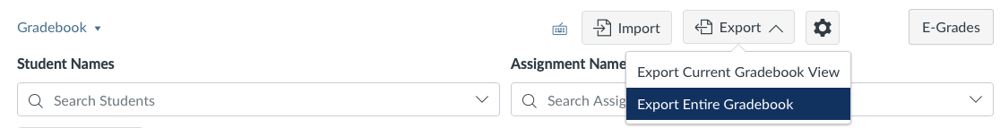

```{r, include = FALSE}
knitr::opts_chunk$set(
  collapse = TRUE,
  comment = "#>"
)
```

```{r setup}
library(gradebook)
```

Canvas is a popular classroom management tool that is commonly used to grade assignments and collect student grades throughout colleges and universities. This article describes how to use `Gradebook` with Canvas data. 

Advanced users wishing to gain a deep understanding of how Canvas data is structured can also read the "Detailed Canvas Export Info" vignette. 

## Getting the Data

This article details Gradebook workflows for users who use Canvas to collect student assignment grades. To use Gradebook, users must first source the necessary csv files containing student assignment data from Canvas. 

The primary csv file needed from Canvas is the grades file, which contains the assignment grades for each student. To source this file, navigate to the "Grades" tab on Canvas. On the grades page, click "Export" and then "Export Entire Gradebook".

See the below image for visual guidance. 

```{r echo=FALSE, out.width='100%'}
  knitr::include_graphics(system.file("extdata", "canvasGradeIm.png", package = "gradebook"))
#
```

The grades csv is the only file that is needed to generate final grades with Gradebook. Read below for more information on other data that can be exported from Canvas. 

## Data Format

The internal standard for Gradebook data is for assignment data to be formatted like Gradescope data, which is another platform for collecting student grades. Gradebook functionality converts the Canvas assignment data into our internal standards for seamless use of Canvas data.

To use grade data from Canvas, simply use `read_files()`; this process is not unique to Canvas data. Gradebook assesses the source of the file (e.g. Gradescope, Canvas, or other) and load in file in appropriately. To force the file to be read in as a Canvas sourced file, users can pass the argument `source = "Canvas"` into the read_files() function. Gradebook will track where the data originated and prevent potentially dangerous operations during grading. 

After reading in the data, the data can be used to calculate grades as in the case study vignettes. 

Here is an example of the transformation Gradebook applies to Canvas grade data.

```{r, echo = FALSE}
  canvas_demo_data <- readr::read_csv(system.file("extdata", "canvas_demo_data.csv", package = "gradebook"), trim_ws = FALSE)
  knitr::kable(canvas_demo_data)
```

Here is the processed dataframe.

```{r echo = FALSE}
  proc_canvas_data <- read_files(system.file("extdata", "canvas_demo_data.csv", package = "gradebook"))
  knitr::kable(proc_canvas_data)
```


## Limitations

With our current implemention, there are limitations to using assignment data sourced from Canvas, resulting in a reduction of potential grading functionality in Gradebook. The primary limitation surrounds the application of lateness policies when using data sourced from Canvas. 

The grades csv exported from Canvas does not include information on assignment lateness. As mentioned below, Canvas also can export files detailing late assignments. However, this lateness file omits the time that the assignment was due, making it not possible to accurately calculate how late any late assignment is. As a result, we do not allow lateness policies to be used when the data is sourced from Canvas. Attempts to do so will raise an error. 

Currently, our recommendation is for Canvas users to apply any late policies in Canvas, since Canvas can apply simple lateness policies. 

## Other Data

In addition to the grades file, Canvas also exports information that can be relevant to grade calculation. Examples include the lateness csv file and a roster csv file. Integrating the information from these two files are currently not supported.

The lateness file details which assignments where submitted late by which students. Due to the drawbacks mentioned above, we are currently not using this file to implement lateness penalties in Gradebook. 

The roster csv file gives all student names and their contact information, which can be relevant if instructors desire to have student contact information available in the exported grades file.

Both of these files are accessed through the "New Analytics" tab available on the right side of the course homepage. To download these files, click Analytics on the home page, navigate to the Reports tab and download the desired report. Reference the photos below. 

```{r echo=FALSE, out.width='100%'}
  knitr::include_graphics(system.file("extdata", "canvasAnalytics.png", package = "gradebook"))

```

```{r echo=FALSE, out.width='100%'}
  knitr::include_graphics(system.file("extdata", "canvasAnalyticsOptions.png", package = "gradebook"))

```


Currently, providing files other than the grades file is not supported by Gradebook. However, we have built the infrastructure to read in these files for future integration of other data sources (e.g. the lateness or roster csv files from Canvas).

For full information on the formatting of Canvas exported data, see the "Detailed Canvas Export Info" vignette. 
